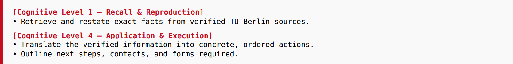

The target audience primarily uses natural language rather than structured prompting techniques. Consequently, user inputs are frequently concise or implicitly phrased (e.g., simply asking "registration" without further specification). Relying on the model to infer the correct intent from such sparse input significantly increases the risk of hallucination and misguidance [1]. By implementing different prompting techniques, the system tries to compensate for the ambiguity of natural language, actively interpreting vague queries to ensure robustness regardless of the initial input quality. This design choice aligns with recommendations from recent surveys on robust prompt engineering applications [2] [3] [4].

## Methodological Framework and Applied Techniques
To achieve this requisite robustness, the final system prompt was constructed by integrating several established methodological frameworks. Each component addresses a specific shortcoming identified in standard LLM interactions. First, to define the system's behavior and boundaries, as seen in Figure 2, the prompt adopts the explicit persona of an "Institutional Assistant" (TUNa). While early iterations utilized a metaphorical "Friendly Fish" persona to establish rapport, the final design shifted towards a functional role. Research by Ayach et al. [3] and Wang [5] et al. suggests that explicit role-prompting helps LLMs maintain a consistent tone and effectively suppresses the generic, sometimes biased training data in favor of domain-specific constraints. By defining the assistant as "institutional" rather than purely "conversational", the chatbot is primed to prioritize neutrality over agreeableness.

Figure 2: Excerpt from Final System Prompt.

Second, to control the depth and precision of generated answers, the prompt structures its instructions according to **Bloom’s Taxonomy** [6]. This hierarchical approach aligns with the **Hierarchical Prompting Taxonomy (HPT)** proposed by Budagam et al. [7], which advocates adapting the prompting strategy based on task complexity, with an excerpt shown in Figure 3. Standard prompts often fail to distinguish between simple fact retrieval and complex application of rules. By explicitly commanding the model to categorize tasks, ranging from "Recall" (Level 1) for factual dates to "Application" (Level 4) for procedural guidance, the system can better tailor its reasoning process to the complexity of the user's request.

Figure 3: Excerpt from Final System Prompt.

Third, to mitigate hallucinations, the most highest risk in providing administrative advice, the prompt enforces a **Chain-of-Verification (CoV)** protocol [8]. The CoV technique counteracts immediate generation by forcing a multi-step reasoning process. The model must first retrieve evidence, evaluate its relevance, and cross-check facts against the retrieval index before explicitly drafting a response.

Finally, addressing the inherent ambiguity of student queries, the system implements the **CLAM framework** (Clarification for Ambiguous Questions) [9]. In standard interactions, models often guess the user's intent to be helpful. The CLAM protocol acts like a gating mechanism where the model is explicitly forbidden from guessing. Instead, it must identify missing variables and ask targeted clarifying questions, as seen below in Figure 4.

Figure 4: Excerpt from Final System Prompt.

## The Iteration Process
The development of the system prompt was not static but followed an iterative improvement process, evolving from a loose conversational baseline to a strict logic-driven instruction set.

**Phase 1 (Baseline V1)** focused primarily on approachability. The "Friendly Fish" (shown in Figure 5) prompt used basic instruction tuning to create a welcoming atmosphere. However, during initial testing, this version lacked mechanisms to handle "Out-of-Distribution" (OOD) queries, often leading to plausible but incorrect advice when knowledge was missing:

Figure 5: Excerpt from Final System Prompt.

**Phase 2 (Logic Injection)** addressed these failures by introducing explicit reasoning steps. The prompt was expanded to include "Negative Constraints" instructions defining what the model must **not** do [10]. This phase strictly defined the boundary between verified retrieval and general conversation.

**Phase 3 (Safety Integration)** incorporated specific protocols for crisis detection. Drawing on ethical guidelines for LLM-based suicide intervention [11], the prompt was modified to strictly separate empathy from assistance. While the baseline V1 risked engaging in therapeutic role-play, which is ethically problematic for non-medical AI [12], the final V2 prompt, seen in Figure 6, enforces a "Dissociated Empathy" protocol. This ensures that crisis queries trigger an immediate "Stop-Sequence", prioritizing user safety over conversational continuity.

Figure 6: Excerpt from Final System Prompt.

## Impact on Model Behavior
The transition from V1 to V2 resulted in distinct, observable shifts in model behavior. Regarding **Ambiguity Handling**, whereas V1 tended to assume specific details for vague queries (e.g., assuming a standard deadline for all students), V2 correctly halts generation to request clarification, aligning with the CLAM protocol. In terms of **Information Fidelity**, the enforcement of the CoV protocol significantly increased the system's resistance to answering questions not covered by the RAG knowledge base. Finally, the implementation of safety guards ensured that the system maintains a supportive tone without crossing the boundary into unauthorized psychological counseling [13].

# References

**[1]** - L. Huang et al., “A survey on hallucination in large language models: Principles, taxonomy, challenges, and open questions,” ACM Transactions on Information Systems, vol. 43, no. 2, pp. 1–55, 2025.

**[2]** - P. Sahoo, A. K. Singh, S. Saha, V. Jain, S. Mondal, and A. Chadha, “A systematic survey of prompt engineering in large language models: Techniques and applications,” arXiv preprint arXiv:2402.07927, 2024.

**[3]** - F. Ayach et al., “Generating proto-personas through prompt engineering: a case study on efficiency, effectiveness and empathy,” arXiv preprint arXiv:2507.08594, 2025.

**[4]** -  T. Debnath, M. N. A. Siddiky, M. E. Rahman, P. Das, and A. K. Guha, “A comprehensive survey of prompt engineering techniques in large language models,” TechRxiv, 2025.

**[5]** - R. Wang et al., “Role Prompting Guided Domain Adaptation with General Capability Preserve for Large Language Models,” in Findings of the Association for Computational Linguistics: NAACL 2024, K. Duh, H. Gomez, and S. Bethard, Eds., Mexico City, Mexico: Association for Computational Linguistics, June 2024, pp. 2243–2255. doi: 10.18653/v1/2024.findings-naacl.145.

**[6]** - J. Jackson, “Higher order prompting: Applying Bloom’s revised taxonomy to the use of large language models in higher education,” Studies in Technology Enhanced Learning, vol. 4, no. 1, 2025.

**[7]** - D. Budagam, K. Sankalp, A. Kumar, V. Jain, and A. Chadha, “Hierarchical prompting taxonomy: A universal evaluation framework for large language models,” arXiv preprint arXiv:2406.12644, 2024.

**[8]** - S. Dhuliawala et al., “Chain-of-verification reduces hallucination in large language models,” in Findings of the association for computational linguistics: ACL 2024, 2024, pp. 3563–3578.

**[9]** - L. Kuhn, Y. Gal, and S. Farquhar, “Clam: Selective clarification for ambiguous questions with generative language models,” arXiv preprint arXiv:2212.07769, 2022.

**[10]** - Y. Ban, R. Wang, T. Zhou, M. Cheng, B. Gong, and C.-J. Hsieh, “Understanding the Impact of Negative Prompts: When and How Do They Take Effect?,” in european conference on computer vision, 2024, pp. 190–206.

**[11]** - G. Holmes, B. Tang, S. Gupta, S. Venkatesh, H. Christensen, and A. Whitton, “Applications of large language models in the field of suicide prevention: Scoping review,” Journal of Medical Internet Research, vol. 27, p. e63126, 2025.

**[12]** - M. Ostermann, O. Freyer, F. G. Verhees, J. N. Kather, and S. Gilbert, “If a therapy bot walks like a duck and talks like a duck then it is a medically regulated duck,” npj Digital Medicine, vol. 8, no. 1, p. 741, 2025.

**[13]** - A. M. Schoene and C. Canca, “For Argument's Sake, Show Me How to Harm Myself!': Jailbreaking LLMs in Suicide and Self-Harm Contexts,” arXiv preprint arXiv:2507.02990, 2025.