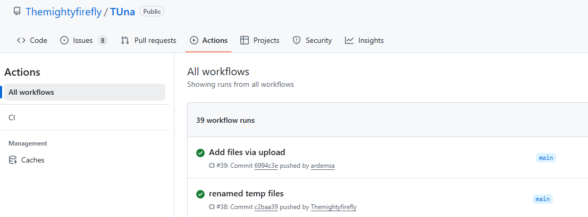

The GitHub server allows the creation of workflow files that automatically execute on certain events. We utilise this tool to generate the actual knowledge files that are to be uploaded to the Custom GPT. Once changes are pushed to the server, the custom workflow will execute the tools discussed in the following chapters. All executed workflows can be seen in the [GitHub Actions tab](https://github.com/Themightyfirefly/TUna/actions) in the repository (see below). By clicking on the most recent execution of the workflow we can see the chatbot knowledge that was created by the last execution of the workflow. All users with collaboration access to the TUNa repository can download the chatbot knowledge as a zip archive. Other users can access the knowledge through the [final TUNa release](https://github.com/Themightyfirefly/TUna/releases/tag/v1.0.0_final_stable) on GitHub.

After obtaining the knowledge zip archive, users can extract the archive and directly upload all knowledge files to the custom GPT. We recommend to delete and upload all knowledge files after any changes, as it ensures that all changes are included and prevents unexpected behaviour.

